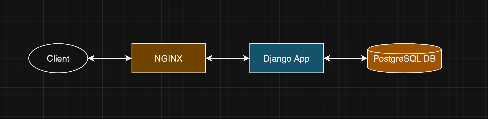

# PyEditorial with PSQL and Dev/Prod Environments
This project is a fork of [https://github.com/mavenium/PyEditorial](https://github.com/mavenium/PyEditorial).

This application is built to work in two different environments: Development and Production. 
The Development environment is all about making it easy and fast for developers to work on 
the project. It uses the runserver command, which allows you to see changes instantly as you
code. 

Each part of the application—like the web server and the database—runs in its own Docker
container, making it simple to manage everything and allowing multiple developers to work
together smoothly. 

On the other hand, the Production environment is designed for when we’re
ready to go live. It uses Gunicorn and Nginx to ensure that the app runs efficiently and 
securely, serving users over HTTPS for safe browsing (now, self signed). 

Just like in Development, we use Docker
containers here too, which helps keep everything organized and easy to scale as needed. 
By having these two environments, we can move seamlessly from building features to deploying
them, ensuring a great experience for both developers and users.




------------
### Run with automated scripts

1. Install Docker on your operating system
2. Give privileges to what you want to use
```
chmod +x start_dev_environment.sh start_prod_environment.sh stop_dev_environment.sh stop_prod_environment.sh
```
3. Run the following command to create and run the dev environment
```
./start_dev_environment.sh
```
4. Go to  `http://127.0.0.1:8000/` in your browser to use dev environment
------------
If you want to use prod environment, run the following command
```
./start_prod_environment.sh
```
Go to  `https://127.0.0.1` or just type `localhost` in your browser to use prod environment with HTTPS.

If you want to stop them, run the following commands
```
./stop_dev_environment.sh
./stop_prod_environment.sh
```
------------
### Run with Docker

1. Install Docker on your operating system
2. Update the environment variables in the docker-compose.prod.yml and docker-compose.dev.yml files.
3. Run the following command to create and run the project
```
docker compose -f docker-compose.dev.yml up [-d]
```
4. Go to  `http://127.0.0.1:8000/` in your browser to use dev environment
```
docker compose -f docker-compose.prod.yml up [-d]
```
4. Go to  `https://127.0.0.1/` in your browser to use prod environment with HTTPS.
------------
### Notes
The Editorial template is released under license "Creative Commons Attribution 3.0 Unported".

------------
